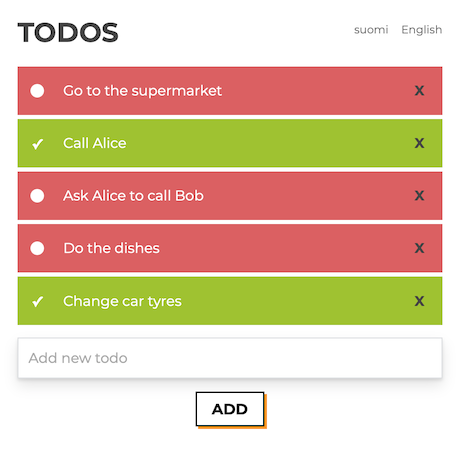

# Assignment

This app is intended as a React pre-task for applying to Buutti as a developer.

**Tasks:**

1. Refactor this app with the following criterion:

- Use only functional components
- Give it a good architectural structure
- Change the UI look to something better. You choose the style.

2. Write unittests to test 1 component well.

**To return:**

- Fork this repo to your own github, gitlab or bitbucket account and send the interviewer the link to that repo.

# Solution

## 1. Refactor
- [x] Use only functional components
- [x] Give it a good architectural structure
  - Converted the project to TypeScript, too
- [x] Change the UI look to something better. You choose the style:

## 2. Tests
- [x] Write unittests to test 1 component well
  - InputBar: `./src/components/InputBar/index.test.tsx`

Also, one additional snapshot test for TodosList component.